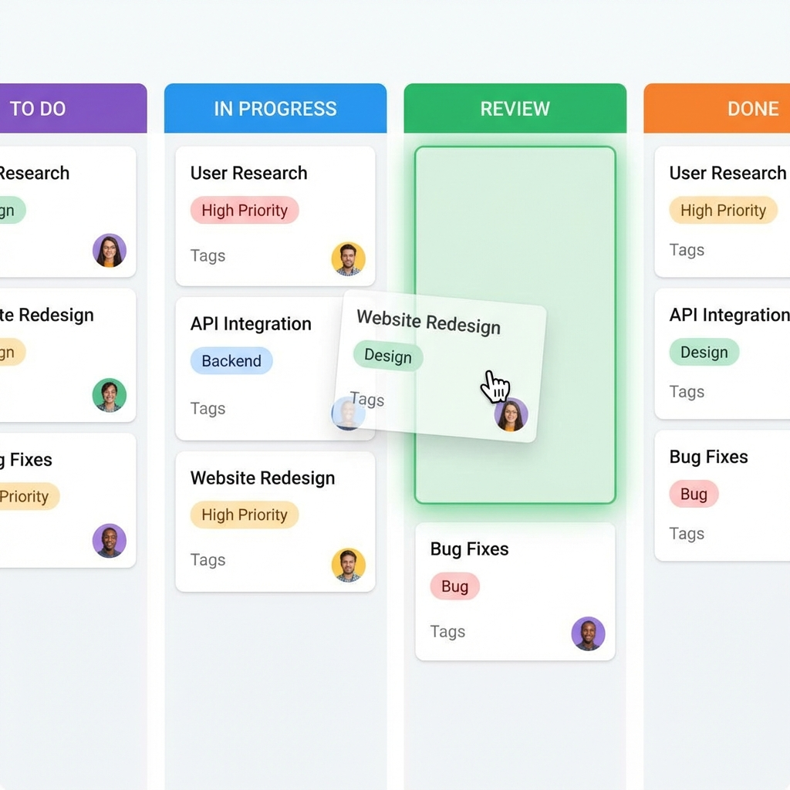

# Flutter Kanban Board



A professional, high-performance, and feature-rich Kanban board implementation for Flutter, built with clean architecture and Riverpod.

**Developed by: Chandan Kumar Singh**

---

## 📖 Board Overview

This project delivers a production-ready Kanban board experience, commonly found in project management tools like Trello, Jira, or Asana. It is designed to be highly modular, allowing developers to easily integrate their own data sources and business logic.

## ✨ Key Features

-   **Interactive Drag & Drop**: smooth, highly responsive reordering of tasks and columns with real-time visual feedback (ghost cards, drop targets).
-   **Smart Auto-Scrolling**:
    -   **Horizontal**: Drag a task to the edge of the board to scroll to other columns.
    -   **Vertical**: Drag a task to the top/bottom of a long column to scroll through the list.
-   **Multi-Board Architecture**: fast context switching between different project boards (e.g., Development vs. Marketing).
-   **Rich Creation Suite**:
    -   **Columns**: Custom color picker with material palette.
    -   **Tasks**: Detailed form with Priority, Due Date, Assignee, and Tags.
-   **Dependency Injection**: Powered by `flutter_riverpod` and the Repository pattern for effortless testing and mocking.

## 📂 Project Structure

The project follows a **Features-First** and **Layered Architecture** to ensure scalability and maintainability.

```
lib/
├── kanban_board/
│   ├── models/
│   │   └── models.dart          # Core domain entities (KanbanTask, KanbanColumn, etc.)
│   ├── providers/
│   │   ├── kanban_provider.dart    # State management (KanbanBoardNotifier, KanbanBoardState)
│   │   └── kanban_repository.dart  # Data abstraction layer (Repository Interface & Implementation)
│   ├── views/
│   │   └── kanban_board_view.dart  # Main board layout and board switching logic
│   └── widgets/
│       ├── kanban_card_widget.dart    # Individual task card UI
│       ├── kanban_column_widget.dart  # Column container with drag targets and scroll logic
│       ├── task_detail_dialog.dart    # Rich dialog for task creation/editing
│       └── skeleton_widgets.dart      # Loading placeholders
└── main.dart                    # Application entry point and theme setup
```

## 🛠 Implementation Details

### 1. Data Layer (`kanban_repository.dart`)
We use an abstract `KanbanRepository` to define the contract for data operations. This allows us to switch between the included `DemoKanbanRepository` (in-memory test data) and a real backend (Firebase, REST API, Supabase) without changing a single line of UI code.

### 2. State Management (`kanban_provider.dart`)
`KanbanBoardNotifier` manages the complex state of the board, including:
-   **Optimistic Updates**: UI updates immediately while data syncs in the background.
-   **Drag State**: Tracks strictly typed drag data to prevent type errors.
-   **Selection**: Handles active board and column focusing.

### 3. The "Ghost" Logic
To achieve the professional "ghost" effect during drag:
-   Actual widgets use `LongPressDraggable`.
-   When dragging starts, the original widget is hidden (opacity 0) but keeps its layout space.
-   A `feedback` widget (the ghost) follows the finger/mouse with a slight rotation and scale for tactile feel.

## 🚀 Getting Started

1.  **Clone the project**:
    ```bash
    git clone https://github.com/your-username/kanban-board.git
    ```
2.  **Install dependencies**:
    ```bash
    flutter pub get
    ```
3.  **Run the application**:
    ```bash
    flutter run
    ```

## 🧩 Customization Guide

### Changing the Theme
Modify `main.dart` to change the `seedColor`. The board automatically derives its gradients and accents from this seed.

### Adding New Fields to Tasks
1.  Update `KanbanTask` in `models.dart`.
2.  Update `KanbanTaskCard` in `kanban_card_widget.dart` to display the field.
3.  Update `_showAddTaskDialog` in `kanban_column_widget.dart` to input the field.

---

**© 2026 Chandan Kumar Singh. All rights reserved.**
